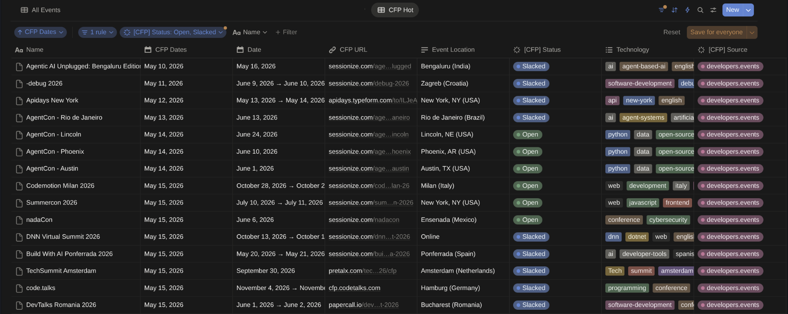
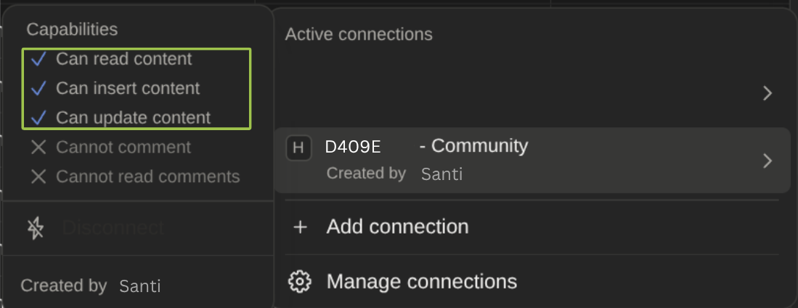
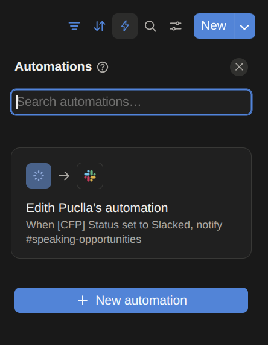
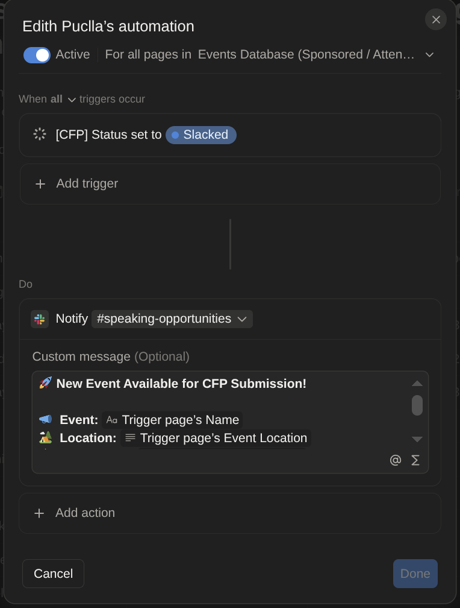
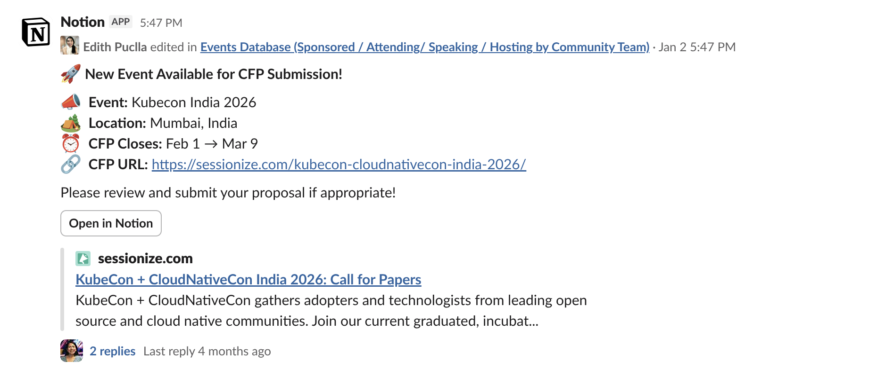
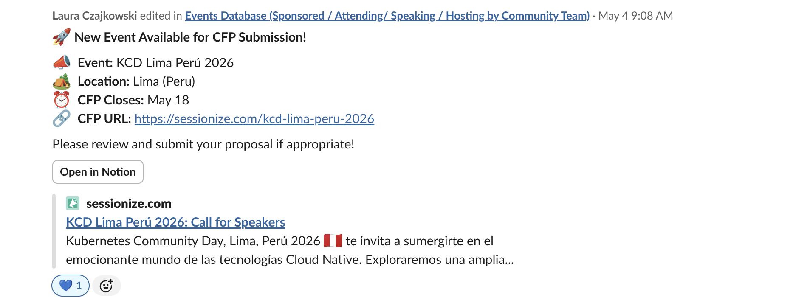

# Conference CFP Tracker

Automatically discover open Call for Papers (CFPs), keep a clean JSON database, sync to Notion, and notify your team on Slack, all on autopilot, every day.

> Built for DevRel and developer advocacy teams who want to stop manually hunting for speaking opportunities. This project sits on top of the [developers.events](https://developers.events/) open data, automates the tracking in Notion, and lets your team curate and share only the relevant CFPs to the rest of the company via Slack.

This project is actively used at **[Percona](https://www.percona.com/)** in the community team to track speaking opportunities for our developer relations team. The screenshots and examples throughout this README reflect our setup, your Notion database name, field names, and Slack channel will likely differ, and that's fine. Adapt them to match your team's workflow.

<!-- screenshot: overview of the Notion database with CFPs -->

---

## How it works

```
developers.events (public API)
        ↓
  Fetch & filter open CFPs daily
        ↓
  Local JSON database (data/events.json)
        ↓
  Sync to Notion (create / update / close)
        ↓
  Team reviews → sets status to "Slacked"
        ↓
  Notion automation → posts to #speaking-opportunities on Slack
```

The pipeline runs automatically every day via GitHub Actions. No manual work needed unless you want to review and promote a CFP to your team.

---

## Data source

CFP data comes from [**developers.events**](https://developers.events/), an open-source project created by [**Aurélie Vache**](https://www.linkedin.com/in/aurelievache/) and maintained by her and the community. Thank you Aurélie for making this data publicly available!

This is not a list of all conferences, it covers **community-driven tech and developer conferences** only. To be listed on developers.events, an event must offer a CFP, be open to the public, and target a developer/tech audience. 

The project consumes two public JSON feeds:
- `https://developers.events/all-events.json`
- `https://developers.events/all-cfps.json`

---

## Integrations

| Tool | Role |
|---|---|
| **developers.events** | Source of all CFP data |
| **Notion** | Central database to track and manage CFPs |
| **Slack** | Team notifications via a Notion Automation |
| **GitHub Actions** | Runs the pipeline daily at 04:00 UTC |

---

## Notion database setup

Create a Notion database with these properties. The names below are the ones we use at Percona,  you can rename them as long as you update the corresponding field names in `scripts/sync_notion.py`.

| Property | Type |
|---|---|
| Name | Title |
| URL | URL |
| CFP URL | URL |
| CFP Dates | Date |
| Date | Date (start + end) |
| Event Location | Rich text |
| Technology | Multi-select |
| [CFP] Status | Status: `Open`, `Active`, `Sent to Slack`, `Closed`, `Archived`, `Needs Review` |
| [CFP] Source | Select: `developers.events` |

### What the sync does

Your Notion database can contain two types of entries: events automatically imported from `developers.events`, and events your team added manually. The `[CFP] Source` field is what distinguishes them — the sync only ever touches rows where `[CFP] Source = developers.events`, so your manually entered events are always left untouched.

- **Create**: new CFPs are added with status `Open` and source `developers.events`.
- **Update**: only source-controlled fields are touched (`CFP Dates`, `CFP URL`, `Technology`). All manual edits (status, notes, tags) are preserved.
- **Reconcile**: pages sourced from `developers.events` that no longer appear in the feed are automatically marked `Closed`. Manual entries are never affected.

Matching is URL-based (normalized: lowercase, no query params, no trailing slash). If a conference changes its URL, a new page is created and the old one is closed.



---

## Connect Notion to this project

To allow the scripts to read and write to your Notion database, you need to create an internal integration in Notion and connect it to your database. This is a one-time setup that gives you the API token the project needs.

1. Go to [https://www.notion.so/profile/integrations](https://www.notion.so/profile/integrations) and create a new **internal integration**.
2. Make sure it has these capabilities: **Can read content**, **Can insert content**, **Can update content**.
3. Copy the **Internal Integration Secret**, this is your `NOTION_API_TOKEN`.
4. Open your Notion database → click `...` (top right) → **Connections** → **Add connection** → select your integration.
5. Copy the **Database ID** from the database URL,  this is your `NOTION_DATABASE_ID`.



---

## Slack notification setup

### 1. Create the automation

Inside your Notion database, click the **Automate** button (top right) and create a new automation:

- **Trigger**: `[CFP] Status` is set to `Slacked` *(or whatever status name you choose)*
- **Action**: Post to your Slack channel (we use `#speaking-opportunities` at Percona — use any channel that fits your team)



### 2. How the configured automation looks

Once created, the automation will appear in your database automations list showing the trigger and the connected Slack channel. No code required — it runs entirely within Notion.




### 3. How it looks in Slack

When a team member sets a CFP status to "Slacked", the automation fires and posts to your Slack channel. Anyone in the company can see it, react, or volunteer to submit a talk.




---

## Setup

To run the pipeline on your own machine, whether to test before deploying, adapt it to your team's setup, or run it without GitHub Actions.

**Requirements:** Python 3.11+

```bash
git clone https://github.com/your-org/conference-cfp-tracker.git
cd conference-cfp-tracker
python3 -m venv .venv
source .venv/bin/activate
pip install -r requirements.txt
```

Set your environment variables:

```bash
export NOTION_API_TOKEN='secret_...'
export NOTION_DATABASE_ID='xxxxxxxx-xxxx-xxxx-xxxx-xxxxxxxxxxxx'
```

For GitHub Actions, add these as repository secrets (`NOTION_API_TOKEN`, `NOTION_DATABASE_ID`).

---

## Testing locally

Always test locally before pushing or syncing to Notion (Specially if you already have data on it, and please always backup things before to try)

### Step 1:  Test the data fetch (no Notion needed)

```bash
python -m scripts.main --limit 10
```

Expected output:
```
Run started at 2026-05-10 04:00:01 UTC
Updated data/events.json: total=10 | added=8 | updated=2 | closed=0

First 10 events (table):
Name                                         | External ID                          | CFP closes   | Link
---------------------------------------------+--------------------------------------+--------------+-----
KubeCon EU 2026                              | developers.events::kubecon...         | 2026-06-01   | https://...
...

Summary:
| fetched: 10
| added: 8
| updated: 2
| closed: 0
| cfp close window: 2026-05-15 → 2026-08-30
```

### Step 2: Preview Notion sync without writing anything

```bash
python -m scripts.sync_notion --dry-run --limit 10
```

Expected output:
```
[DRY-RUN] CREATE: KubeCon EU 2026 (https://kccnceu2026.sched.com)
[DRY-RUN] UPDATE: PyCon US 2026 (https://us.pycon.org/2026)
...
Summary:
| created: 8
| updated: 2
| processed: 10
| dry-run
```

### Step 3: Apply to Notion

```bash
# Small batch first
python -m scripts.sync_notion --reconcile-missing --limit 10

# Full run
python -m scripts.sync_notion --reconcile-missing
```

---

## Automated daily run

The pipeline runs automatically via `.github/workflows/daily-update.yml` every day at 04:00 UTC:

1. Fetches and updates `data/events.json`
2. Syncs to Notion and reconciles closed CFPs
3. Commits any changes back to the repo

To trigger it manually: go to **Actions → Daily CFP Update → Run workflow**.

---

## Repo layout

```
data/           # Local JSON database (events.json)
scripts/
  main.py       # Fetch + merge pipeline
  fetch_data.py # Pulls from developers.events API
  merge_diff.py # Compares and saves to local DB
  sync_notion.py # Syncs to Notion API
.github/
  workflows/
    daily-update.yml  # Scheduled GitHub Action
```

---

## Credits

- [**Aurélie Vache**](https://www.linkedin.com/in/aurelievache/), creator of [developers.events](https://developers.events/), the open-source platform that makes this project possible.
- The [developers.events community](https://github.com/scraly/developers-conferences-agenda) for maintaining the conference data.
